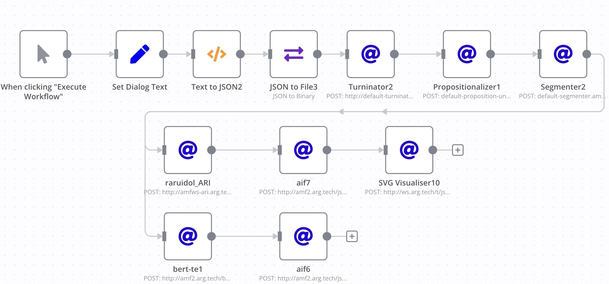
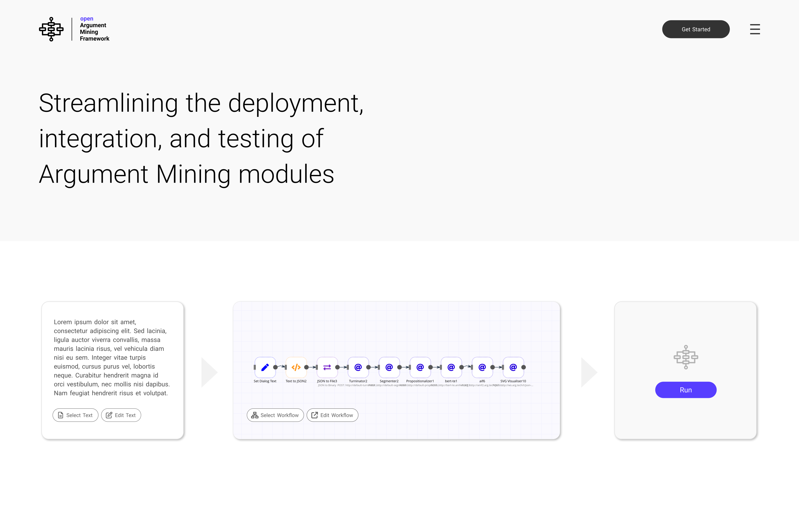

# Open Argument Mining Framework (oAMF) Documentation

## Table of Contents
1. [Introduction](#introduction)
2. [The Open Argument Mining Framework (oAMF)](#the-open-argument-mining-framework-oamf)
   - [Module Development](#module-development)
   - [Deployment](#deployment)
   - [Using oAMF for Creating and Running Pipelines](#using-oamf-for-creating-and-running-pipelines)
3. [Creating and Running Pipelines](#creating-and-running-pipelines)
   - [Programming API](#programming-api)
   - [Drag-and-Drop Interface](#drag-and-drop-interface)
   - [Web Interface](#web-interface)
4. [Module Development](#module-development-1)
   - [Input-Output Format](#input-output-format)
   - [Implementation](#implementation)
5. [Existing Modules](#existing-modules)
6. [Resources](#resources)

---

## Introduction
The **Open Argument Mining Framework (oAMF)** is a modular, open-source framework designed to enable the creation and execution of Argument Mining (AM) workflows. It integrates multiple modules, allowing flexibility and scalability across different AM tasks. This guide provides comprehensive instructions on how to install and use oAMF, develop new modules, and integrate them into a seamless pipeline for argument mining.

---

## The Open Argument Mining Framework (oAMF)

oAMF facilitates the building and execution of Argument Mining (AM) pipelines. It supports integration with several tools and workflows, including web interfaces, APIs, and drag-and-drop interfaces, to make AM tasks more accessible.

### Module Development

Developers can add custom modules to the framework, which should follow specific input/output formats and configuration standards. These modules are deployed as web services (typically using Flask) and are containerized to ensure portability.

- **Input-Output Format**: All modules must accept and output data in the **xAIF format**. The [xAIF library](https://pypi.org/project/xaif/0.3.2/) helps handle this format.
- **Flask Web Services**: Each module is containerized and runs as a Flask web service, making it easy to deploy and integrate into pipelines.
- **Metadata Specification**: Each module includes metadata describing the tasks it supports and the required formats. This metadata is stored in a `metadata.yml` file.

For a detailed guide on adding modules, see the [Module Development Section](#module-development-1).

---

### Deployment

To use oAMF, you can install the open-source Python library via pip:
```bash
pip install oAMF
```

Once installed, you can deploy modules either locally or remotely. The deployment process is designed to be simple, involving loading modules from GitHub repositories or via web services. Modules are dynamically loaded to minimize memory and computational overhead.

Example API script to load modules:
```python
from oamf import oAMF

oamf = oAMF()  # Initialize the library

# Modules to load: URL, type (repo or ws), route, and tag

modules_to_load = [
    ("https://github.com/arg-tech/default_turninator.git", "repo", "turninator-01", "turninator"),
    ("https://github.com/arg-tech/default_segmenter.git", "repo", "segmenter-01", "segmenter"),
    ("http://targer.amfws.arg.tech/targer-segmenter", "ws", "targer-segmenter", "targer"),
    ("http://default-proposition-unitiser.amfws.arg.tech/propositionUnitizer-01", "ws", "propositionUnitizer-01", "propositionUnitizer"),
    ("http://bert-te.amfws.arg.tech/bert-te", "ws", "bert-te", "bert-te")
]
oamf.load_modules(modules_to_load)  # Load and deploy the modules
```


---

## Using oAMF for Creating and Running Pipelines

oAMF supports several interfaces for creating and executing AM pipelines:

### Programming API

The programming API allows you to define a pipeline programmatically as a directed graph of interconnected modules. You can specify the modules by their tags and execute the pipeline using an input file in xAIF format.

Example API for creating a pipeline:
```python
from oamf import oAMF

oamf = oAMF()  # Initialize the library

# Define pipeline as a graph
# Define the pipeline using module tags
pipeline_graph = [
    ("turninator", "segmenter"),   # "turninator" outputs to "segmenter"
    ("segmenter", "propositionUnitizer")      # "segmenter" outputs to "bert-te"
    ("propositionUnitizer", "bert-te")      # "segmenter" outputs to "bert-te"
]

# Execute the pipeline using the defined workflow and an input file in xAIF format
output_path, xaif_result = oamf.pipelineExecutor(pipeline_graph, "example_input_file.json") # It writes the output to a temp file and also returns the xaif output
```

More examples provided in Jupyter notebook: [https://github.com/arg-tech/oAMF/blob/main/example/example_usage.ipynb](https://github.com/arg-tech/oAMF/blob/main/example/example_usage.ipynb)


---

### Drag-and-Drop Interface

oAMF integrates with **n8n**, an open-source workflow automation tool, to offer a drag-and-drop interface for building pipelines. Users can easily arrange modules and define their interactions visually.

Once a pipeline is constructed in n8n, it can be executed directly within the interface or exported as a JSON file for execution via the API.

For more information on n8n, visit [n8n.io](https://n8n.arg.tech).


---

### Web Interface


The web interface allows users to execute pre-built pipelines on the oAMF server without needing to manually configure them. You can upload input data and run the pipeline directly from the web.


---

## Module Development

### Input-Output Format

To ensure compatibility with oAMF, all modules must handle input and output in **xAIF format**. The [xAIF library](https://pypi.org/project/xaif/0.3.5/) provides a Python package to manipulate and structure xAIF data.

For more details, visit the [xAIF documentation](https://github.com/arg-tech/xaif/blob/main/docs/tutorial.md).

More examples provided in Jupyter notebook: [https://github.com/arg-tech/xaif/blob/main/docs/xaif_example.ipynb](https://github.com/arg-tech/xaif/blob/main/docs/xaif_example.ipynb)


---

### Implementation

Modules are developed as independent repositories on GitHub and deployed as containerized Flask web services. A module’s structure typically includes:

- `metadata.yml`: Contains metadata about the module.
- `Dockerfile` and `docker-compose.yml`: Defines the containerization of the service.
- Python code: Defines the logic for processing xAIF input/output.

For detailed information on module implementation, refer to the [New Module Development](#New-Module-Development).

---

## Existing Modules

Below is a table summarizing the existing oAMF modules, their inputs, outputs, and associated repositories and web services.

| **Module** | **Input** | **Output** | **Web-Service URL** | **Repo URL** |
|------------|-----------|------------|---------------------|--------------|
| `DTSG` | Unsegmented text and no structure. | Text segmented into turns (i.e. contiguous text from one speaker in the case of dialogue; NOOP in the case of monologue). | [http://default-turninator.amfws.arg.tech/turninator-01](http://default-turninator.amfws.arg.tech/turninator-01) | [https://github.com/arg-tech/default_turninator](https://github.com/arg-tech/default_turninator) |
| `DSG` | Unsegmented text; no structure. | Segmented text; structure containing L-nodes with IDs crossreferring to those in SPAN tags. | [http://default-segmenter.amfws.arg.tech/segmenter-01](http://default-segmenter.amfws.arg.tech/segmenter-01) | [https://github.com/arg-tech/default_segmenter](https://github.com/arg-tech/default_segmenter) |
| `TARGER` | Unsegmented text; no structure. | Segmented text; structure containing L-nodes with IDs crossreferring to those in SPAN tags. | [http://targer.amfws.arg.tech/targer-segmenter](http://targer.amfws.arg.tech/targer-segmenter) | [https://github.com/arg-tech/targer](https://github.com/arg-tech/targer) |
| `DARJ` | Segmented locutions. | Resolve co-references in locution nodes. | [cascading-propositionUnitiser.amfws.arg.tech/anaphora-01](cascading-propositionUnitiser.amfws.arg.tech/anaphora-01) | [https://github.com/arg-tech/cascading_propositionaliser](https://github.com/arg-tech/cascading_propositionaliser) |
| `SPG` | Segmented text; structure containing L-nodes. | Segmented text segmented; structure containing L-nodes anchoring YA-nodes connected to I-nodes. | [http://default-proposition-unitiser.amfws.arg.tech/propositionUnitizer-01](http://default-proposition-unitiser.amfws.arg.tech/propositionUnitizer-01) | [https://github.com/arg-tech/proposition-unitizer](https://github.com/arg-tech/proposition-unitizer) |
| `CPJ` | Segmented text ; structure containing L-nodes. | Segmented text; structure containing L-nodes anchoring YA-nodes connected to I-nodes. | [http://cascading-propositionUnitiser.amfws.arg.tech/propositionaliser-cascading](http://cascading-propositionUnitiser.amfws.arg.tech/propositionaliser-cascading) | [https://github.com/arg-tech/cascading_propositionaliser](https://github.com/arg-tech/cascading_propositionaliser) |
| `DAMG` | Segmented text; structure with I-nodes. | Segmented text; structure with I-nodes connected with RA and CA nodes. | [http://dam.amfws.arg.tech/dam-03](http://dam.amfws.arg.tech/dam-03) | [https://github.com/arg-tech/dam](https://github.com/arg-tech/dam) |
| `DTERG` | Segmented text; structure with I-nodes. | Segmented text; structure with I-nodes connected with RA nodes. | [http://bert-te.amfws.arg.tech/bert-te](http://bert-te.amfws.arg.tech/bert-te) | [https://github.com/arg-tech/bert-te](https://github.com/arg-tech/bert-te) |
| `PDSCZ` | Segmented text; structure with I-nodes connected with RA nodes. | Segmented text; structure with I-nodes connected with RA nodes specified by pragma-dialectical scheme type. | [http://amfws-schemeclassifier.arg.tech/schemes_clsf](http://amfws-schemeclassifier.arg.tech/schemes_clsf) | [https://github.com/arg-tech/rae-arg-scheme-classification](https://github.com/arg-tech/rae-arg-scheme-classification) |
| `SARIM` | xAIF file containing the proposition nodes (information nodes) in argument. | xAIF file containing the input and new nodes (i.e RA,CA) which are related relations between nodes, and edges information which are connected between I nodes throughout the relation nodes. | [http://amfws-rp.arg.tech/somaye](http://amfws-rp.arg.tech/somaye) | [https://github.com/arg-tech/AMF-RP](https://github.com/arg-tech/AMF-RP) |
| `ARIR` | xAIF file containing the segmented and pre-processed propositional argumentative nodes. | xAIF file with the complete propositional argument graph. For each predicted argumentative relation, a new node (RA, CA, or MA), and two edges connecting the argument propositions are added to the input xAIF file. | [http://amfws-ari.arg.tech/](http://amfws-ari.arg.tech/) | [https://github.com/arg-tech/AMF_ARI](https://github.com/arg-tech/AMF_ARI) |
| `DRIG` | xAIF file containing the I nodes. | Segmented text; structure with I-nodes connected with RA,MA and CA nodes. | [http://vanilla-am-caasr.amfws.arg.tech/caasra](http://vanilla-am-caasr.amfws.arg.tech/caasra) | [https://github.com/arg-tech/dialogpt-am-vanila](https://github.com/arg-tech/dialogpt-am-vanila) |
| `WSCR` | xAIF file containing I nodes and the RA between them. | xAIF file where the "Default Inference" relations have been replaced by a specific argumentation scheme (e.g., "Argument From Analogy"). | [http://amf-schemes.amfws.arg.tech](http://amf-schemes.amfws.arg.tech) | [https://github.com/arg-tech/AMF_SchemeClassifier](https://github.com/arg-tech/AMF_SchemeClassifier) |
| `PTCR` | xAIF file containing I nodes. | xAIF file with the "propositionClassifier" key containing the list of I nodes with one of the three types (i.e., Value, Policy, and Fact) assigned to them. | [http://amf-ptc.amfws.arg.tech](http://amf-ptc.amfws.arg.tech) | [https://github.com/arg-tech/AMF_PTC_VFP](https://github.com/arg-tech/AMF_PTC_VFP) |
| `CASS` | Two xAIF files | F1 Macro/Accuracy/CASS/Text Similarity/Kappa/U-Alpha | [http://amf-evaluation-score.amfws.arg.tech](http://amf-evaluation-score.amfws.arg.tech) | [https://github.com/arg-tech/amf-evaluation-score](https://github.com/arg-tech/amf-evaluation-score) |
| `WSTT` | Audio Input | xAIF with the text field populated with transcription | [realtime-backend.amfws.arg.tech/transcribe_whisper-0](realtime-backend.amfws.arg.tech/transcribe_whisper-0) | [https://github.com/arg-tech/realtime-backend](https://github.com/arg-tech/realtime-backend) |


---

## Resources

- **xAIF Library**: [PyPI Package](https://pypi.org/project/xaif/0.3.5/)
- **n8n**: [n8n.io](https://n8n.io)
- **oAMF GitHub Repository**: [GitHub Link](https://github.com/arg-tech/oamf)
- **Official oAMF Website**: [oAMF Website](https://oamf.arg.tech)

For detailed development and contribution guidelines, please refer to the [oAMF GitHub Repository](https://github.com/arg-tech/oamf).

---


## New Module Development
\label{app:newmodule}

The **oAMF module** is a web service that is **dockerized** for portability and scalability. It is built using the **Flask framework**, a lightweight Python web framework designed for creating RESTful services. This module processes and outputs **xAIF data**.

### Key Features:
- **Web Service**: The application exposes a set of endpoints that allow users to interact with the module via HTTP requests.
- **Dockerized**: The module is packaged into a Docker container to facilitate easy deployment and scaling. The container is configured using the `Dockerfile` and `docker-compose.yaml` files.

### Project Structure
The project follows a standard web application structure with the following components:

- **`config/metadata.yaml`**: Contains metadata about the module (See Section \ref{sec:metadata}).
- **`project_src_dir/`**: The directory containing the application code, including Flask routes and logic.
- **`boot.sh`**: A shell script to activate the virtual environment and launch the application.
- **`docker-compose.yaml`**: Defines the Docker services and how the application is built and run.
- **`Dockerfile`**: Specifies the Docker image, environment, and installation of dependencies.
- **`requirements.txt`**: Lists the Python dependencies required by the project.

### Metadata Configuration (`config/metadata.yaml`)
\label{sec:metadata}
The `metadata.yaml` file stores essential information about the module, including:

```yaml
Name: "Name of the Module"
Date: "2024-10-01"
Originator: "Author"
License: "Your License"
AMF_Tag: "Your_tag_name"
Domain: "Dialog"
Training Data: "Annotated corpus X"
Citation: ""
Variants:
  - name: 0 version: null
  - name: 1 version: null
Requires: text
Outputs: segments
```

### Flask Application Routes
- **Index Route (`/`)**: Displays the contents of the `README.md` file, serving as a documentation route.
- **AMF Module Route**: This route can have any name. 
  - The **POST request** is used to upload an xAIF file, which is processed using the module's logic. The response is returned as a JSON object containing the updated xAIF data.
  - The **GET request** is used to provide documentation and metadata.

### Summary of Steps to Develop an oAMF Module
To create a custom oAMF module, follow these steps:

1. Clone the NOOP template from the repository: [https://github.com/arg-tech/AMF_NOOP](https://github.com/arg-tech/AMF_NOOP).
2. **Modify Metadata**: Update `metadata.yaml` with the module's details.
3. **Implement Core Logic**: Modify `routes.py` to add the module functionality.
4. **Integrate with xAIF**: Use the `xaif` library to manipulate xAIF data.
5. **Configure Docker**: Ensure the `Dockerfile` and `docker-compose.yaml` are correctly set up.
6. **Documentation**: Update the `README.md` file with usage instructions.


*This documentation is continuously updated as new modules and features are added to the oAMF ecosystem.*
```
